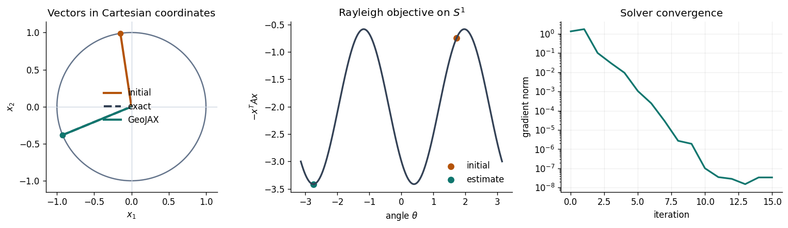
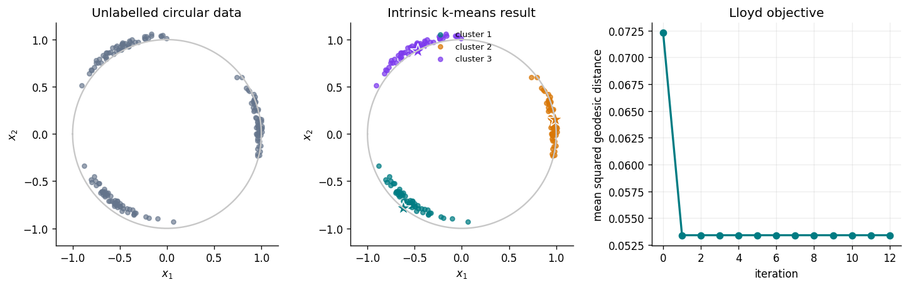
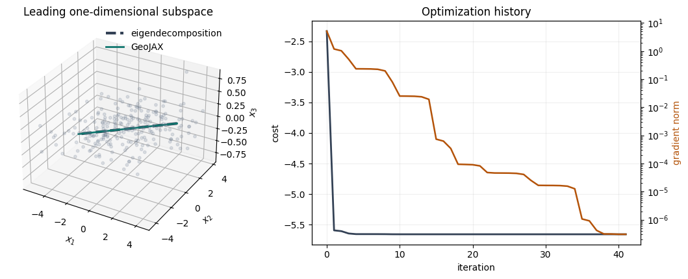
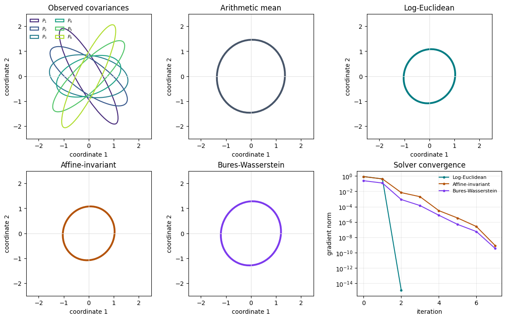
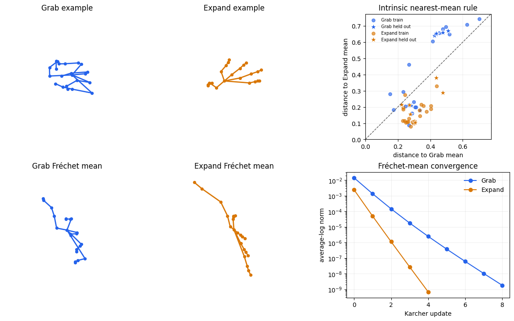
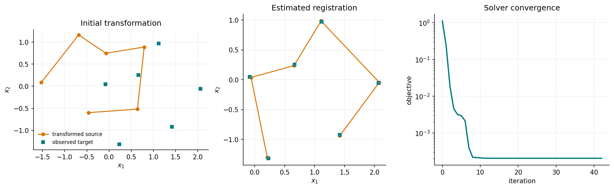
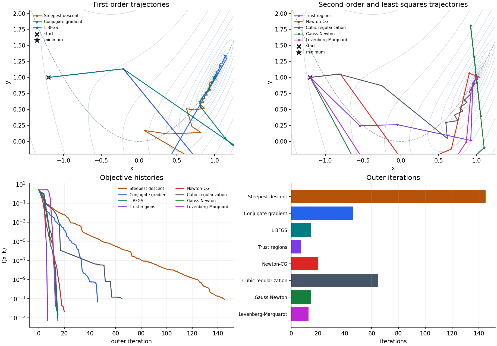
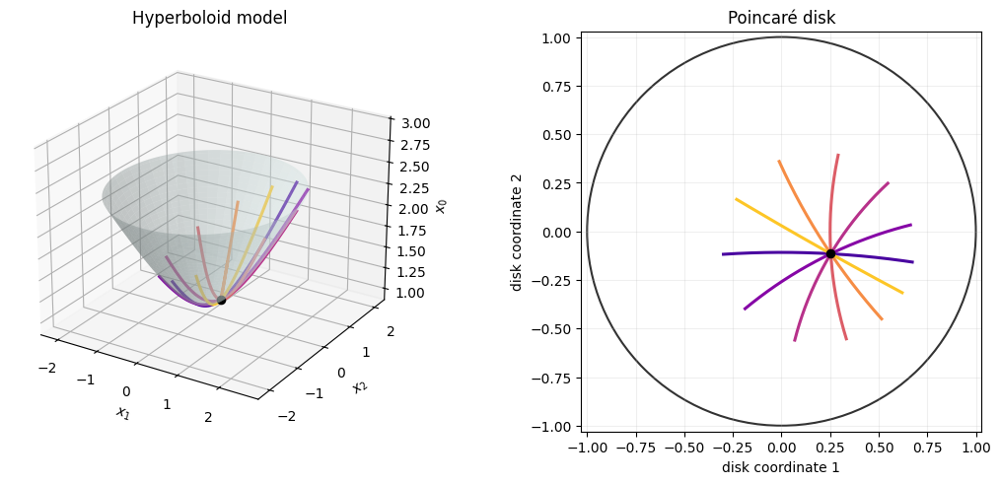
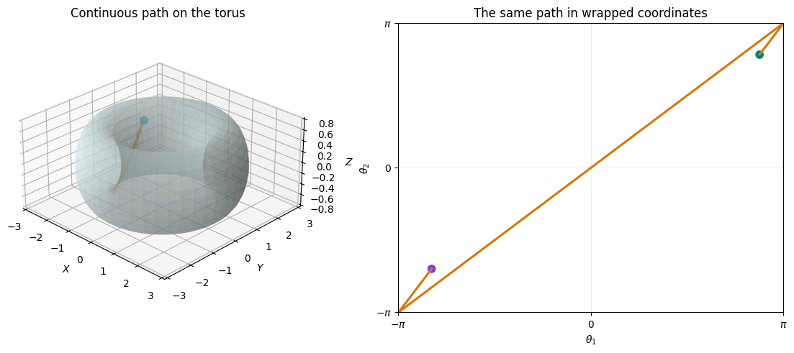

# Tutorials

Each tutorial develops a geometric problem from its mathematical formulation
through an executable GeoJAX solution and a visual report of the result.

## Practical methods

<div class="tutorial-gallery">
  <a class="tutorial-card" href="sphere_eigenvector.html">
    <div class="tutorial-card-media">
      
    </div>
    <div class="tutorial-card-body">
      <p class="tutorial-card-meta">Sphere / Optimization</p>
      <h2>Dominant eigenvector on the circle</h2>
      <p>Find the leading eigenvector of a symmetric matrix by optimizing the Rayleigh quotient on S<sup>1</sup>.</p>
    </div>
  </a>

  <a class="tutorial-card" href="sphere_kmeans.html">
    <div class="tutorial-card-media">
      
    </div>
    <div class="tutorial-card-body">
      <p class="tutorial-card-meta">Sphere / Clustering</p>
      <h2>Intrinsic k-means on the circle</h2>
      <p>Cluster circular data with geodesic assignments and Fréchet-mean center updates.</p>
    </div>
  </a>

  <a class="tutorial-card" href="grassmann_pca.html">
    <div class="tutorial-card-media">
      
    </div>
    <div class="tutorial-card-body">
      <p class="tutorial-card-meta">Grassmann / Data analysis</p>
      <h2>Principal component as a subspace</h2>
      <p>Recover a one-dimensional principal subspace from a synthetic point cloud on Gr(1, 3).</p>
    </div>
  </a>

  <a class="tutorial-card" href="spd_frechet_mean.html">
    <div class="tutorial-card-media">
      
    </div>
    <div class="tutorial-card-body">
      <p class="tutorial-card-meta">SPD / Statistics</p>
      <h2>Competing Fréchet means of SPD matrices</h2>
      <p>Compare log-Euclidean, affine-invariant, and Bures-Wasserstein covariance means.</p>
    </div>
  </a>

  <a class="tutorial-card" href="kendall_hand_shapes.html">
    <div class="tutorial-card-media">
      
    </div>
    <div class="tutorial-card-body">
      <p class="tutorial-card-meta">Kendall shape / Real data</p>
      <h2>Hand poses in Kendall shape space</h2>
      <p>Compute intrinsic means and classify SHREC'17 hand poses using rotation-, scale-, and translation-invariant distances.</p>
    </div>
  </a>

  <a class="tutorial-card" href="rigid_registration.html">
    <div class="tutorial-card-media">
      
    </div>
    <div class="tutorial-card-body">
      <p class="tutorial-card-meta">SE(2) / Registration</p>
      <h2>Rigid landmark registration</h2>
      <p>Estimate a planar rotation and translation jointly by optimizing over the special Euclidean group.</p>
    </div>
  </a>

  <a class="tutorial-card" href="solver_comparison.html">
    <div class="tutorial-card-media">
      
    </div>
    <div class="tutorial-card-body">
      <p class="tutorial-card-meta">Optimization / Solver choice</p>
      <h2>Comparing solvers in a curved valley</h2>
      <p>Contrast first-order, Hessian-based, and least-squares methods on one visual two-dimensional objective.</p>
    </div>
  </a>

</div>

## Geometry in pictures

<div class="tutorial-gallery">

  <a class="tutorial-card" href="hyperbolic_geodesics.html">
    <div class="tutorial-card-media">
      
    </div>
    <div class="tutorial-card-body">
      <p class="tutorial-card-meta">Hyperbolic / Geometry</p>
      <h2>Geodesics on the hyperboloid</h2>
      <p>Trace unit-speed geodesics and compare the hyperboloid and Poincaré-disk views.</p>
    </div>
  </a>

  <a class="tutorial-card" href="torus_geodesics.html">
    <div class="tutorial-card-media">
      
    </div>
    <div class="tutorial-card-body">
      <p class="tutorial-card-meta">Torus / Geometry</p>
      <h2>Wrapped geodesics on the torus</h2>
      <p>See why a smooth shortest path can jump across the edge of an angular chart.</p>
    </div>
  </a>
</div>

```{toctree}
:hidden:
:maxdepth: 1

sphere_eigenvector
sphere_kmeans
grassmann_pca
spd_frechet_mean
kendall_hand_shapes
rigid_registration
solver_comparison
hyperbolic_geodesics
torus_geodesics
```
