# Tutorials

Each tutorial develops a geometric problem from its mathematical formulation
through an executable GeoJAX solution and a visual report of the result.

## Geometric deep learning

<div class="tutorial-gallery">

  <a class="tutorial-card" href="manifold_autoencoder.html">
    <div class="tutorial-card-media">
      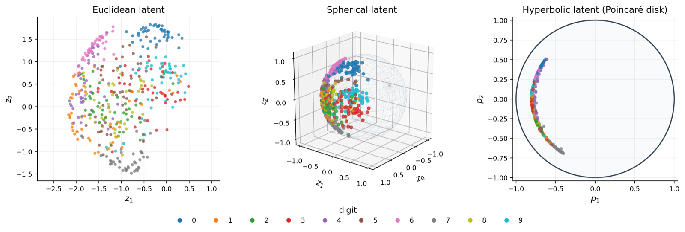
    </div>
    <div class="tutorial-card-body">
      <p class="tutorial-card-meta">Deep learning / Representation learning</p>
      <h2>Autoencoders with curved latent spaces</h2>
      <p>Train matched deterministic autoencoders on handwritten digits and compare Euclidean, spherical, and hyperbolic latents.</p>
    </div>
  </a>

  <a class="tutorial-card" href="graph_curvature.html">
    <div class="tutorial-card-media">
      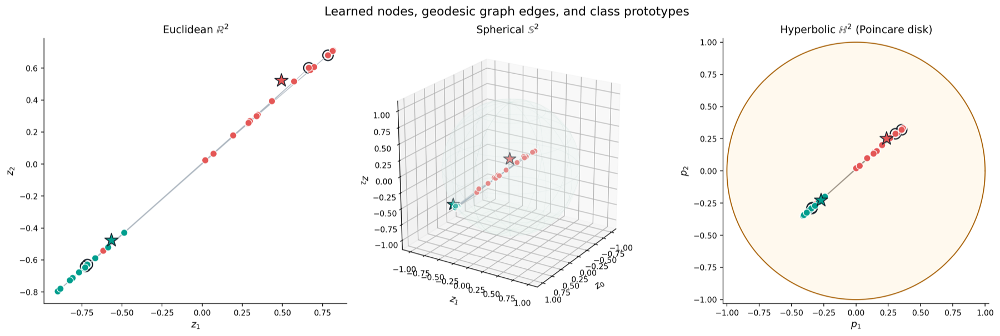
    </div>
    <div class="tutorial-card-body">
      <p class="tutorial-card-meta">Graph learning / Node classification</p>
      <h2>Curvature-aware graph learning</h2>
      <p>Train matched intrinsic graph classifiers and compare Euclidean, spherical, and hyperbolic node representations.</p>
    </div>
  </a>

  <a class="tutorial-card" href="spd_eeg_classifier.html">
    <div class="tutorial-card-media">
      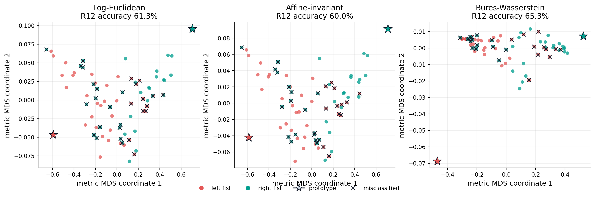
    </div>
    <div class="tutorial-card-body">
      <p class="tutorial-card-meta">SPD learning / Real EEG</p>
      <h2>SPD prototype networks for motor-imagery EEG</h2>
      <p>Transform public sensorimotor EEG into covariance features and compare three geometric prototype heads.</p>
    </div>
  </a>
</div>

## Geometric computation

<div class="tutorial-gallery">

  <a class="tutorial-card" href="hyperbolic_geodesics.html">
    <div class="tutorial-card-media">
      
    </div>
    <div class="tutorial-card-body">
      <p class="tutorial-card-meta">Hyperbolic / Geometry</p>
      <h2>Geodesics on the hyperboloid</h2>
      <p>Trace unit-speed geodesics and compare the hyperboloid and Poincaré-disk views.</p>
    </div>
  </a>

  <a class="tutorial-card" href="torus_geodesics.html">
    <div class="tutorial-card-media">
      
    </div>
    <div class="tutorial-card-body">
      <p class="tutorial-card-meta">Torus / Geometry</p>
      <h2>Wrapped geodesics on the torus</h2>
      <p>See why a smooth shortest path can jump across the edge of an angular chart.</p>
    </div>
  </a>
</div>

## Statistics and learning

<div class="tutorial-gallery">

  <a class="tutorial-card" href="manifold_classification.html">
    <div class="tutorial-card-media">
      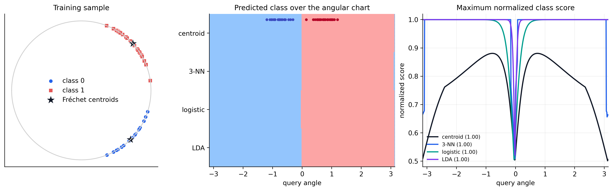
    </div>
    <div class="tutorial-card-body">
      <p class="tutorial-card-meta">Sphere / Classification</p>
      <h2>Classification with manifold-valued predictors</h2>
      <p>Compare Fréchet centroids, geodesic k-NN, tangent logistic regression, and intrinsic-coordinate LDA.</p>
    </div>
  </a>

  <a class="tutorial-card" href="manifold_response_regression.html">
    <div class="tutorial-card-media">
      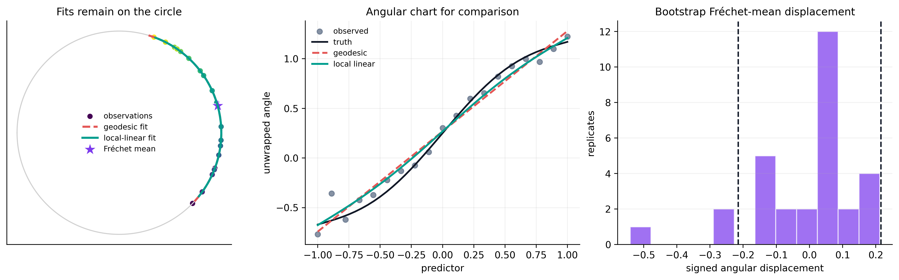
    </div>
    <div class="tutorial-card-body">
      <p class="tutorial-card-meta">Sphere / Manifold response</p>
      <h2>Regression with circular responses</h2>
      <p>Fit parametric geodesic and local Fréchet regressions, then bootstrap a central circular response.</p>
    </div>
  </a>

  <a class="tutorial-card" href="barycentric_dictionary.html">
    <div class="tutorial-card-media">
      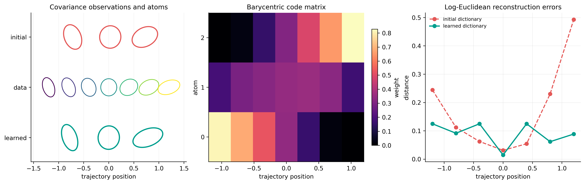
    </div>
    <div class="tutorial-card-body">
      <p class="tutorial-card-meta">SPD / Representation learning</p>
      <h2>Barycentric covariance dictionaries</h2>
      <p>Replace linear combinations with intrinsic Karcher equations and learn positive-definite covariance atoms.</p>
    </div>
  </a>

  <a class="tutorial-card" href="robust_scalable_learning.html">
    <div class="tutorial-card-media">
      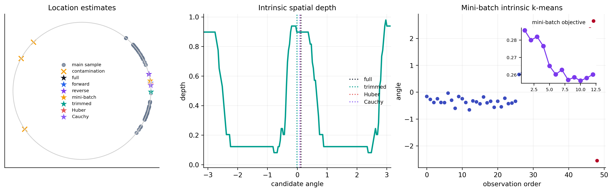
    </div>
    <div class="tutorial-card-body">
      <p class="tutorial-card-meta">Sphere / Robust and scalable</p>
      <h2>Robust and scalable summaries</h2>
      <p>Contrast full, streaming, mini-batch, trimmed, and geodesic M-estimates on contaminated circular data.</p>
    </div>
  </a>

  <a class="tutorial-card" href="semi_supervised_circle.html">
    <div class="tutorial-card-media">
      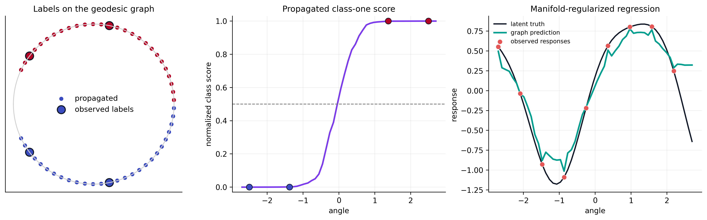
    </div>
    <div class="tutorial-card-body">
      <p class="tutorial-card-meta">Sphere / Semi-supervised learning</p>
      <h2>Semi-supervised learning on the circle</h2>
      <p>Propagate sparse labels and smooth scalar responses over a geodesic-distance graph.</p>
    </div>
  </a>

  <a class="tutorial-card" href="grassmann_pca.html">
    <div class="tutorial-card-media">
      
    </div>
    <div class="tutorial-card-body">
      <p class="tutorial-card-meta">Grassmann / Data analysis</p>
      <h2>Principal component as a subspace</h2>
      <p>Recover a one-dimensional principal subspace from a synthetic point cloud on Gr(1, 3).</p>
    </div>
  </a>

  <a class="tutorial-card" href="hyperbolic_kmeans.html">
    <div class="tutorial-card-media">
      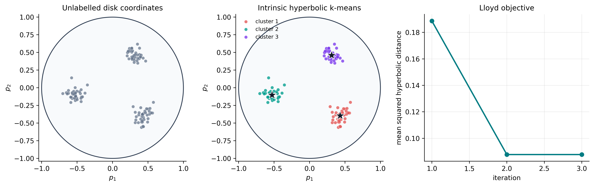
    </div>
    <div class="tutorial-card-body">
      <p class="tutorial-card-meta">Hyperbolic / Clustering</p>
      <h2>Intrinsic k-means in hyperbolic space</h2>
      <p>Cluster points on the hyperboloid and inspect geodesic assignments through the Poincare disk.</p>
    </div>
  </a>

  <a class="tutorial-card" href="robust_spherical_summaries.html">
    <div class="tutorial-card-media">
      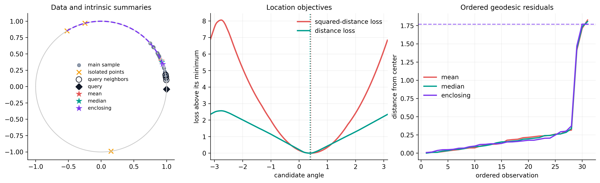
    </div>
    <div class="tutorial-card-body">
      <p class="tutorial-card-meta">Sphere / Robust statistics</p>
      <h2>Robust location summaries on the circle</h2>
      <p>Compare the Fréchet mean, geometric median, enclosing ball, nearest neighbors, and a geodesic interpolation.</p>
    </div>
  </a>

  <a class="tutorial-card" href="clustering_comparison.html">
    <div class="tutorial-card-media">
      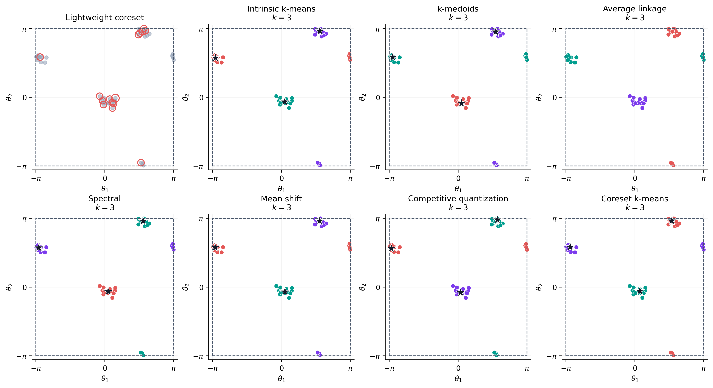
    </div>
    <div class="tutorial-card-body">
      <p class="tutorial-card-meta">Torus / Clustering</p>
      <h2>Comparing clustering methods</h2>
      <p>Contrast seven methods on periodic data whose clusters cross the boundaries of an angular chart.</p>
    </div>
  </a>

  <a class="tutorial-card" href="spd_frechet_mean.html">
    <div class="tutorial-card-media">
      
    </div>
    <div class="tutorial-card-body">
      <p class="tutorial-card-meta">SPD / Statistics</p>
      <h2>Competing Fréchet means of SPD matrices</h2>
      <p>Compare log-Euclidean, affine-invariant, and Bures-Wasserstein covariance means.</p>
    </div>
  </a>

  <a class="tutorial-card" href="kendall_hand_shapes.html">
    <div class="tutorial-card-media">
      
    </div>
    <div class="tutorial-card-body">
      <p class="tutorial-card-meta">Kendall shape / Real data</p>
      <h2>Shape-space inference for hand poses</h2>
      <p>Compute intrinsic means, classify SHREC'17 hand poses, and test the two pose populations with Fréchet ANOVA.</p>
    </div>
  </a>

  <a class="tutorial-card" href="two_sample_inference.html">
    <div class="tutorial-card-media">
      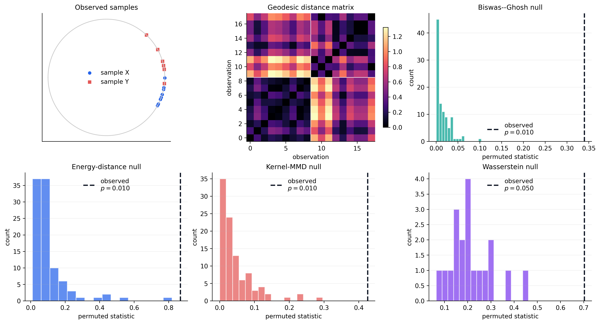
    </div>
    <div class="tutorial-card-body">
      <p class="tutorial-card-meta">Sphere / Inference</p>
      <h2>Two-sample inference on the circle</h2>
      <p>Compare Fréchet ANOVA, distance, energy, PSD-kernel MMD, and exact-Wasserstein permutation tests.</p>
    </div>
  </a>

  <a class="tutorial-card" href="spd_pga_regression.html">
    <div class="tutorial-card-media">
      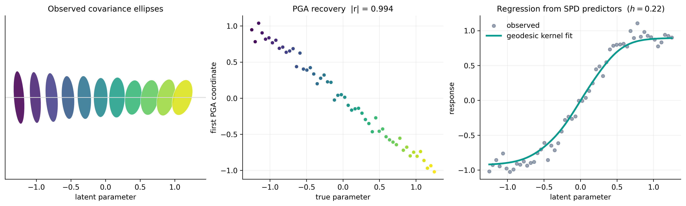
    </div>
    <div class="tutorial-card-body">
      <p class="tutorial-card-meta">SPD / Regression</p>
      <h2>PGA and regression with SPD predictors</h2>
      <p>Recover a covariance trajectory with PGA and fit a scalar response directly from manifold distances.</p>
    </div>
  </a>

  <a class="tutorial-card" href="product_adapter.html">
    <div class="tutorial-card-media">
      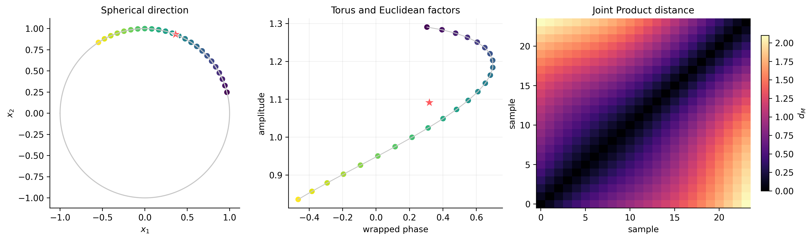
    </div>
    <div class="tutorial-card-body">
      <p class="tutorial-card-meta">Product / Data adaptation</p>
      <h2>Adapting nested Product data</h2>
      <p>Convert mixed scientific representations into one validated pytree and reuse it across learning methods.</p>
    </div>
  </a>

  <a class="tutorial-card" href="optimal_transport.html">
    <div class="tutorial-card-media">
      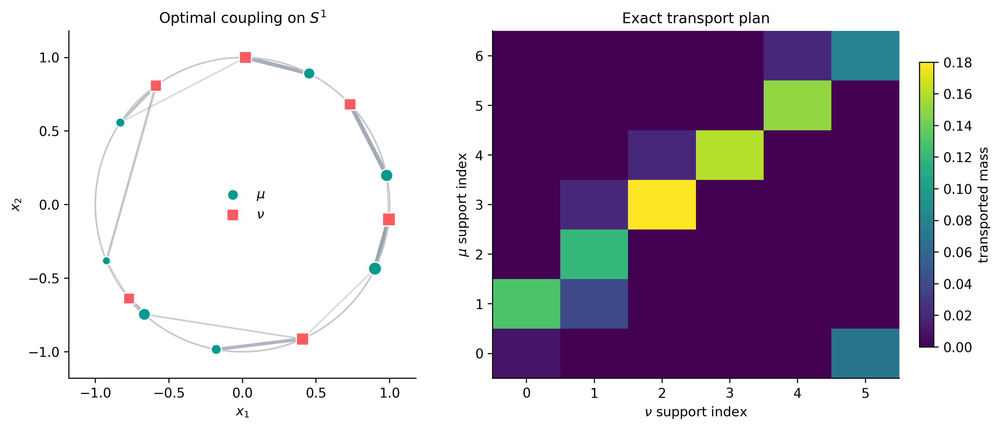
    </div>
    <div class="tutorial-card-body">
      <p class="tutorial-card-meta">Sphere / Optimal transport</p>
      <h2>Exact transport on the circle</h2>
      <p>Solve a weighted transportation problem with geodesic costs and inspect feasibility and duality diagnostics.</p>
    </div>
  </a>

  <a class="tutorial-card" href="dimension_reduction.html">
    <div class="tutorial-card-media">
      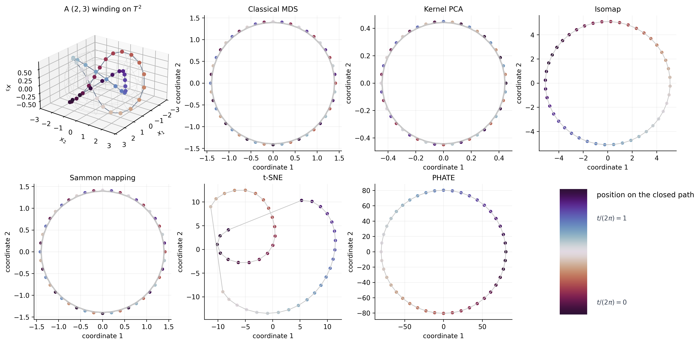
    </div>
    <div class="tutorial-card-body">
      <p class="tutorial-card-meta">Torus / Dimension reduction</p>
      <h2>Embedding a torus trajectory</h2>
      <p>Compare MDS, kernel PCA, Isomap, Sammon mapping, t-SNE, and PHATE on one closed winding.</p>
    </div>
  </a>

  <a class="tutorial-card" href="grassmann_metric_learning.html">
    <div class="tutorial-card-media">
      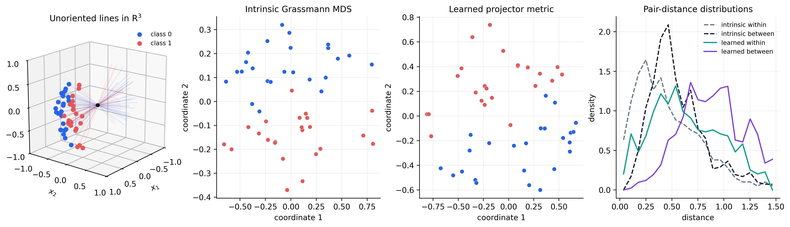
    </div>
    <div class="tutorial-card-body">
      <p class="tutorial-card-meta">Grassmann / Supervised learning</p>
      <h2>Supervised metric learning on subspaces</h2>
      <p>Learn a task-specific metric on projector embeddings and compare it with intrinsic principal-angle distance.</p>
    </div>
  </a>
</div>

## Optimization and inverse problems

<div class="tutorial-gallery">

  <a class="tutorial-card" href="sphere_eigenvector.html">
    <div class="tutorial-card-media">
      
    </div>
    <div class="tutorial-card-body">
      <p class="tutorial-card-meta">Sphere / Optimization</p>
      <h2>Dominant eigenvector on the circle</h2>
      <p>Find the leading eigenvector of a symmetric matrix by optimizing the Rayleigh quotient on S<sup>1</sup>.</p>
    </div>
  </a>

  <a class="tutorial-card" href="rigid_registration.html">
    <div class="tutorial-card-media">
      
    </div>
    <div class="tutorial-card-body">
      <p class="tutorial-card-meta">SE(2) / Registration</p>
      <h2>Rigid landmark registration</h2>
      <p>Estimate a planar rotation and translation jointly by optimizing over the special Euclidean group.</p>
    </div>
  </a>

  <a class="tutorial-card" href="solver_comparison.html">
    <div class="tutorial-card-media">
      
    </div>
    <div class="tutorial-card-body">
      <p class="tutorial-card-meta">Optimization / Solver choice</p>
      <h2>Comparing solvers in a curved valley</h2>
      <p>Contrast first-order, Hessian-based, and least-squares methods on one visual two-dimensional objective.</p>
    </div>
  </a>
</div>

```{toctree}
:hidden:
:maxdepth: 1

hyperbolic_geodesics
torus_geodesics
manifold_autoencoder
graph_curvature
spd_eeg_classifier
grassmann_pca
hyperbolic_kmeans
manifold_classification
manifold_response_regression
barycentric_dictionary
robust_scalable_learning
semi_supervised_circle
robust_spherical_summaries
clustering_comparison
spd_frechet_mean
kendall_hand_shapes
two_sample_inference
spd_pga_regression
product_adapter
optimal_transport
dimension_reduction
grassmann_metric_learning
sphere_eigenvector
rigid_registration
solver_comparison
```
